# 🧠 NeuroVision AI — Multimodal Alzheimer Early Risk Screening System

<p align="center">
  <b>A multimodal AI system that fuses MRI scans, voice patterns, and clinical text to screen for early Alzheimer's risk.</b>
</p>

<p align="center">
  
  
  
  
  
</p>

---

## 📖 Overview

**NeuroVision AI** is a multimodal early-screening system for Alzheimer's disease risk. Instead of relying on a single data source, it combines three independent signals — **brain MRI scans**, **voice/speech recordings**, and **written clinical text** — into one weighted, explainable risk assessment.

Early detection of Alzheimer's is critical for timely intervention, but each individual signal (imaging, speech, or self-reported symptoms) only tells part of the story. NeuroVision AI's multimodal fusion approach aims to provide a more complete and reliable picture than any single-modality model could offer on its own.

---

## 🎯 Problem Statement

Alzheimer's disease is often diagnosed late, when cognitive decline has already progressed significantly. Existing AI screening tools typically focus on a single modality (only MRI, or only speech), which limits their reliability and misses complementary signals.

NeuroVision AI addresses this by building three independent classifiers — for MRI, audio, and text — and fusing their outputs into a single, weighted risk score, along with visual explainability (saliency maps) so the reasoning behind a prediction is transparent, not a black box.

---

## ✨ Key Features

- 🧠 **MRI Classification** — A MobileNetV2-based CNN (with fine-tuning) classifies brain scans as **Demented** or **Non-Demented**, with support for finer-grained categories (Non-Demented, Very Mild, Mild, Moderate Dementia).
- 🎙️ **Voice/Speech Analysis** — Extracts MFCC (Mel-Frequency Cepstral Coefficient) features from speech recordings and uses a CNN to detect dementia-related speech patterns.
- 📝 **Clinical Text Analysis** — A TF-IDF + Machine Learning ensemble analyzes written patient descriptions for linguistic indicators of cognitive decline.
- 🔗 **Weighted Multimodal Fusion Engine** — Combines the three model outputs into one final assessment: **Healthy**, **Low Risk**, **Moderate Risk**, or **High Risk** — along with a combined Dementia Score.
- 🔥 **Explainable AI (XAI)** — Generates **Saliency Maps** and **Brain Attention Overlays** highlighting exactly which brain regions influenced the MRI model's prediction.
- 🌐 **Unified Interactive Dashboard** — Built with **Gradio**, allowing a user to upload an MRI scan, a speech recording, and clinical text together, and receive one combined, easy-to-read report.
- 📊 **Full Model Evaluation** — Score distributions, ROC curves with AUC for all three models, and dataset distribution breakdowns.

---

## 🛠️ Tech Stack

| Category | Tools / Libraries |
|---|---|
| Vision (MRI) | TensorFlow/Keras, MobileNetV2 (transfer learning + fine-tuning) |
| Audio | Librosa (MFCC extraction), CNN |
| NLP (Text) | Scikit-learn (TF-IDF + ML ensemble) |
| Explainability | Saliency Maps, Brain Attention Overlay |
| Interface | Gradio |
| Environment | Google Colab + Google Drive |

---

## ⚙️ How the System Works (Pipeline)

1. **MRI Model** — Loads and preprocesses MRI scans, trains a MobileNetV2 classifier, then fine-tunes the top layers for higher accuracy. A saliency map and brain attention overlay are generated for every prediction.
2. **Audio Model** — Extracts MFCC features from speech recordings and trains a CNN to classify dementia vs. non-dementia speech patterns.
3. **Text Model** — Vectorizes written clinical descriptions with TF-IDF and classifies cognitive-decline indicators using a machine learning ensemble.
4. **Fusion Engine** — Combines the three model outputs using **weighted scoring** (MRI 40%, Audio 30%, Text 30%) into one final Dementia Score and risk category.
5. **Unified Dashboard** — A Gradio interface lets a user submit an MRI scan, a voice recording, and clinical text together, running a "Full Diagnosis" that returns individual model results plus the combined multimodal assessment.

---

## 🖼️ Demo

<p align="center">
  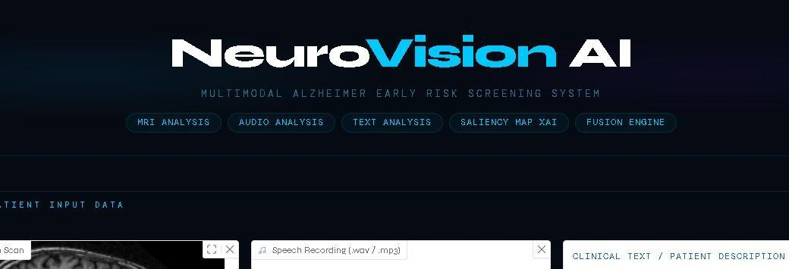
</p>

<p align="center">
  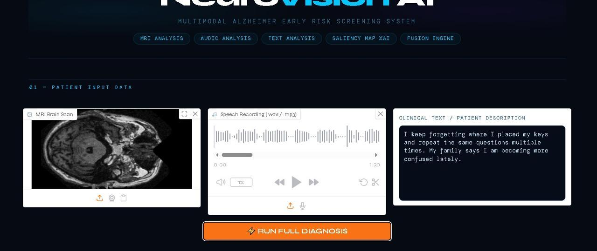
</p>

**Patient Input:** MRI brain scan, speech recording, and clinical text description are submitted together via the "Run Full Diagnosis" button.

<p align="center">
  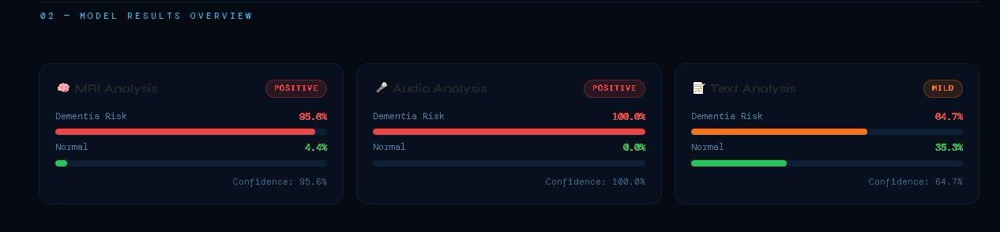
</p>

**Individual Model Results:** MRI Analysis (95.6% dementia risk), Audio Analysis (100% dementia risk), and Text Analysis (64.7% dementia risk, Mild).

<p align="center">
  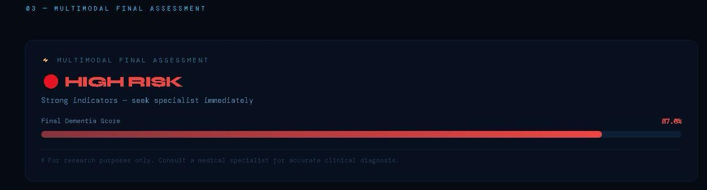
</p>

**Final Multimodal Assessment:** The fusion engine combines all three signals into a single **HIGH RISK** verdict with a Final Dementia Score of 87.6%.

<p align="center">
  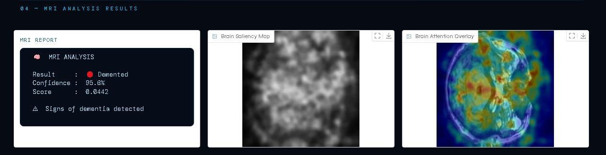
</p>

**MRI Explainability:** The MRI report alongside its Brain Saliency Map and Brain Attention Overlay, visually highlighting the regions that influenced the "Demented" classification.

<p align="center">
  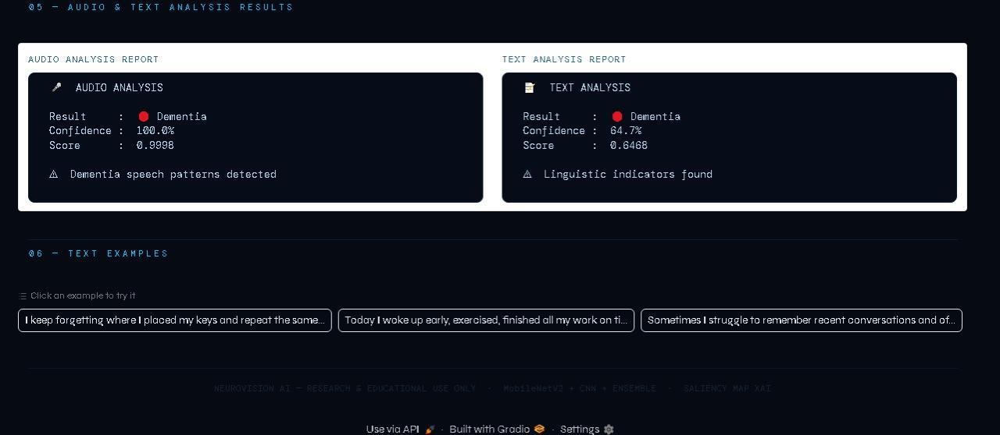
</p>

**Audio & Text Reports:** Detailed breakdowns of the audio analysis (Dementia speech patterns detected) and text analysis (Linguistic indicators found), with example inputs users can try.

---

## 📊 Model Evaluation

<p align="center">
  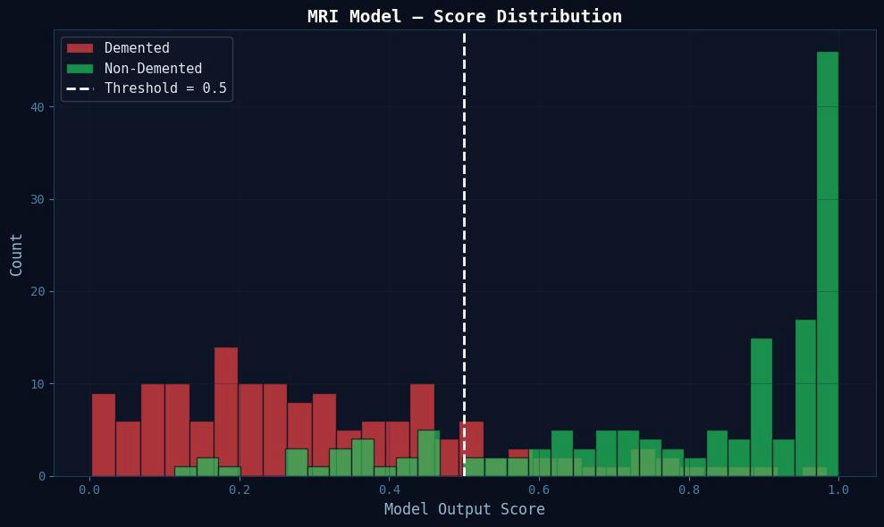
  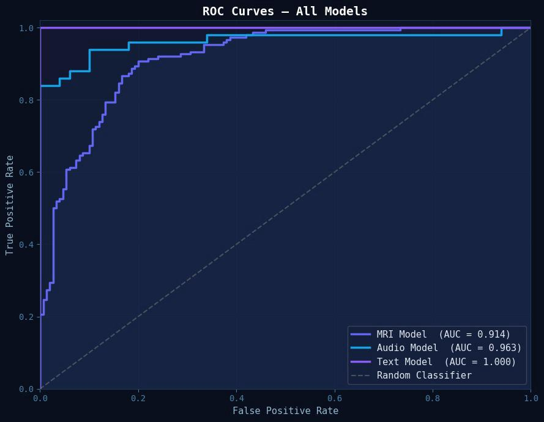
</p>

- **MRI Model Score Distribution:** Shows a clear separation between Demented and Non-Demented predictions around the 0.5 threshold.
- **ROC Curves — All Models:** The Text model achieves a perfect AUC of **1.000**, the Audio model reaches **0.963**, and the MRI model reaches **0.914** — all significantly outperforming a random classifier.

<p align="center">
  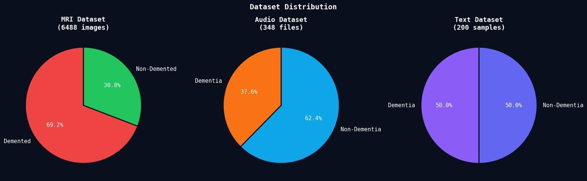
</p>

**Dataset Distribution:** MRI dataset (6,488 images, 69.2% Demented), Audio dataset (348 files, 37.6% Dementia), and Text dataset (200 samples, perfectly balanced 50/50).

<p align="center">
  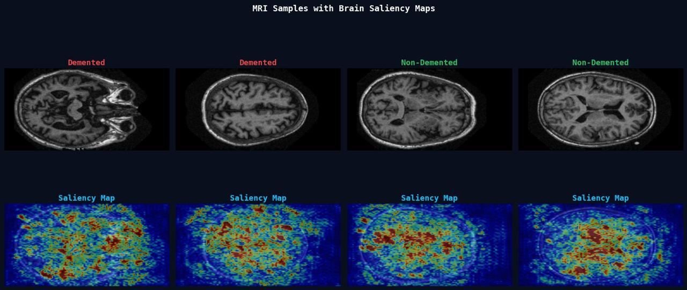
</p>

**MRI Samples with Saliency Maps:** Example Demented and Non-Demented scans alongside their corresponding saliency heatmaps.

---

## 🏗️ System Architecture

<p align="center">
  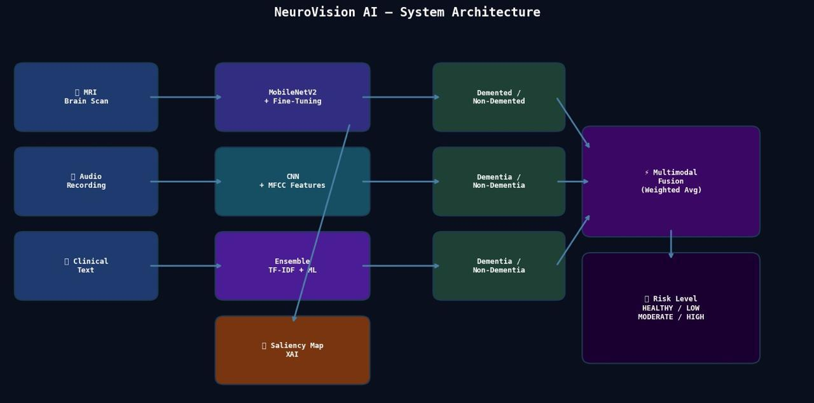
</p>

Each modality (MRI, Audio, Clinical Text) is processed by its own dedicated model (MobileNetV2 + Fine-Tuning, CNN + MFCC Features, and a TF-IDF + ML Ensemble respectively). Each produces an independent Demented/Non-Demented classification plus a saliency map for the MRI branch. All three outputs then feed into the **Multimodal Fusion (Weighted Avg)** engine, which produces the final **Risk Level**: Healthy, Low, Moderate, or High.

---

## 🚀 Installation & Usage

### 1. Clone the repository
```bash
git clone https://github.com/ghadaalsulami-coder/alzheimer-early-risk-screening.git
cd alzheimer-early-risk-screening
```

### 2. Install dependencies
```bash
pip install -r requirements.txt
```

### 3. Run the notebook
Open `FINAL_ALZHEIMER_SYSTEM.ipynb` in Jupyter Notebook or Google Colab and run all cells in order to:
- Train/load the MRI, Audio, and Text models
- Launch the Gradio dashboard

### 4. Use the dashboard
1. Upload an MRI brain scan.
2. Upload a speech recording (.wav / .mp3).
3. Enter a clinical text description (or select an example).
4. Click **Run Full Diagnosis**.
5. Review the individual model results, saliency maps, and the final multimodal risk assessment.

---

## 📂 Project Structure

| File | Description |
|---|---|
| `FINAL_ALZHEIMER_SYSTEM.ipynb` | Main notebook — MRI/Audio/Text models, fusion engine, dashboard |
| `requirements.txt` | Project dependencies |
| `app_header.png` | Demo image — app header and navigation |
| `patient_input_page.png` | Demo image — patient input page |
| `model_results_overview.png` | Demo image — individual model results |
| `final_multimodal_assessment.png` | Demo image — final fused risk assessment |
| `mri_analysis_results.png` | Demo image — MRI report + saliency maps |
| `audio_text_results.png` | Demo image — audio & text analysis reports |
| `mri_score_distribution.png` | Evaluation — MRI model score distribution |
| `roc_curves_all_models.png` | Evaluation — ROC curves for all 3 models |
| `dataset_distribution.png` | Evaluation — dataset class distribution |
| `mri_saliency_samples.png` | Evaluation — MRI samples with saliency maps |
| `system_architecture.png` | Diagram — full system architecture |
| `README.md` | Project documentation |

---

## ⚠️ Disclaimer

This project is an **academic / research prototype** for early risk screening only. It is **not a certified diagnostic medical tool** and must not be used as a substitute for professional medical evaluation. Any concerns about Alzheimer's or cognitive health should be discussed with a qualified physician.

---

## 🔮 Future Improvements

- Expand the dataset across all modalities for improved generalization.
- Add longitudinal tracking to monitor risk changes over time per patient.
- Integrate additional biomarkers (e.g., genetic risk factors) into the fusion engine.
- Deploy as a clinical-decision-support tool with proper regulatory validation.

---

## 👩‍💻 Author

**Ghada Alsulami**
📌 Email: gabdullh84@gmail.com


## 📜 License

This project is licensed under the **MIT License** — you are free to use, modify, and distribute it with proper attribution.
